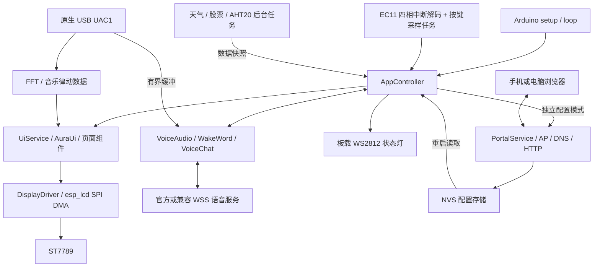

# AuraGeek

基于 **ESP32-S3 + LVGL** 的桌面交互终端：把时钟天气、室内温湿度、股票日线、音乐律动和语音 AI 放在一块 320×240 的小屏幕上，通过 EC11 旋转编码器操作，并使用手机或电脑网页完成配网和个性化配置。

项目保留自己的 UI、驱动和应用结构，通过兼容的小智语音协议连接云端服务，**不是直接烧录官方整机固件，也不是在 ESP32 上运行大语言模型**。本地负责显示、输入、唤醒、音频处理和设备配置；语音识别、对话生成与语音合成由服务端完成。

> 当前定位：可构建、可在指定硬件上运行的开发基线，部分核心链路已实机验收，尚非完成量产验证的产品。本文说明截至 **2026-09-15** 的实现；详细接线、操作与验证边界见 [Wiki](Wiki.md)。

## 目录

- [功能与实现状态](#功能与实现状态)
- [硬件与接线](#硬件与接线)
- [设备操作](#设备操作)
- [快速开始](#快速开始)
- [手机与电脑网页配置](#手机与电脑网页配置)
- [软件架构](#软件架构)
- [关键运行链路](#关键运行链路)
- [存储与资源管理](#存储与资源管理)
- [开发与测试](#开发与测试)
- [安全与使用边界](#安全与使用边界)
- [常见问题](#常见问题)
- [后续工作](#后续工作)
- [依赖与许可说明](#依赖与许可说明)

## 功能与实现状态

| 模块 | 当前功能 | 状态与边界 |
|---|---|---|
| 首页 HOME | NTP 时钟、日期、秒环、天气、24 小时天气温度趋势、AHT20 温湿度、Wi-Fi 状态 | 首页配色保存与断电恢复已实机确认；室内传感器与室外天气是不同数据来源 |
| 股票 STOCKS | 默认 QQQ/VOO；1–6 个自选标的；半年、1 年、3 年、5 年、全部；双均线和区间涨跌 | 日线收盘价，不是实时行情；范围切换不请求网络；均线配置保存与掉电恢复已验收 |
| 频谱 SPECTRUM | 霓虹镜像水波倒影、无文字呼吸环形；双击调出样式轮盘 | 倒影优先音乐视觉效果，不是精密频谱仪；显示增益固定 200% |
| AI 助手 AGENT | “你好小陈”唤醒、语音唤醒应答、静音自动发送、连续问答、情绪表情、板载灯状态 | 官方服务基本语音链路已实机验收；半双工，未实现边听边说或语音打断 |
| 板内设置 SETTINGS | 背光、喇叭音量、切页模式、默认频谱、设备信息、网页配置入口 | 实时预览、确认保存、取消还原；正常设置和掉电保存已实机确认 |
| 网页配置 | AP 配网、设备名称、位置/时区、首页配色、股票参数、聊天节奏、服务连接、JSON 导入导出 | 手机真实配色/输入链路已验证；桌面与手机尺寸浏览器已覆盖多项交互，更多实机场景仍待测试 |
| 恢复出厂 | 恢复本机用户配置、清除用户 Wi-Fi，保留官方 AI 绑定 | 已实机确认：重新配网无需再次激活，可直接唤醒并聊天；恢复中途断电另待验证 |
| USB 音频 | 原生 USB UAC1 输入电脑 PCM 音频，驱动频谱并输出到单只喇叭 | 已出声；杂音、忽大忽小等听感问题尚未验收通过 |
| Micro SD | 已预留独立 SPI 引脚 | **未启用驱动、未验证读写**；当前运行不依赖 SD 卡 |

当前没有网页 OTA、任意 OpenAI API 接入、MCP 设备工具、独立网络音乐播放器、AEC 回声消除或全双工聊天。网页配置项与原型 HTML 中的概念功能不等同，实际功能以固件为准。

## 硬件与接线

### 当前验证平台

- 主控：ESP32-S3-WROOM-1-N16R8，16 MB Flash、8 MB OPI PSRAM。
- 显示：2.4 英寸 ST7789 TFT + EC11 一体模块，SPI、无触摸、横屏 320×240。
- 输入：EC11 A/B/PUSH，加独立 KEY0。
- 传感器：AHT20，I²C。
- 收音：INMP441，I²S 左声道。
- 播放：MAX98357A + 8 Ω / 2 W 喇叭，当前调试供电为 3.3 V。
- 状态灯：开发板板载单颗 WS2812，GPIO48。
- 下载/日志：CH343 USB 转 UART；音频输入：ESP32-S3 原生 USB。

引脚定义以 [BoardPins.h](include/board/BoardPins.h) 和 [TftSetup.h](include/board/TftSetup.h) 为准。**GPIO 编号不是排针序号**；不同开发板、屏幕批次和模块不能只凭外观照搬。

| 模块 | 模块信号 → ESP32-S3 GPIO | 供电/备注 |
|---|---|---|
| TFT | SCL/CLK → 12，SDA/MOSI → 11，RES → 14，DC → 13，CS → 10，BLK → 18 | VCC → 3.3 V；GND 共地 |
| EC11 / KEY0 | A → 39，B → 40，PUSH → 21，KEY0 → 41 | 按键低电平有效 |
| AHT20 | SDA → 8，SCL → 9 | 3.3 V，地址 `0x38`，100 kHz |
| INMP441 | WS → 4，SCK/BCLK → 5，SD → 6 | 3.3 V；**L/R 接 GND，不悬空** |
| MAX98357A | BCLK → 7，LRC → 15，DIN → 16，SD_MODE → 17 | 当前 VIN 为合规 3.3 V 电源；GAIN 保留模块默认 |
| 板载 WS2812 | DIN → 48 | 板内连接，不额外接灯 |
| CH343 / UART0 | ESP TX → 43，ESP RX → 44 | 板内连接，115200 baud |
| 原生 USB | D− → 19，D+ → 20 | 板内连接，使用原生 USB 数据口 |
| SD 模块，仅预留 | SCK → 42，MOSI → 1，MISO → 2，CS → 47 | 为当前带稳压/电平转换的 5 V 模块预留，ESP 侧信号必须为 3.3 V |

接线注意：

- 所有接线调整在断电后进行，各模块共地；不要把 5 V 信号直接接入 ESP GPIO。
- 功放 `SPK+`、`SPK−` 分别接喇叭两端，**SPK− 不是 GND**。GPIO10 是屏幕片选，不是功放使能。
- 默认数字音量为 100%，不等于输出功率已测定。首次上电先降低板内音量再试音；核对开发板稳压器余量、功放模块电平和发热。
- 当前屏幕配置 SPI **80 MHz**，只代表本机实验配置；不保证其他 ST7789 模块在此频率下可靠。没有 TE 接线，不能承诺严格无撕裂。
- CH343 口用于下载与日志，原生 USB 口用于电脑音频，两者不能混用。板载 USB 差分线无需手工飞线。
- 并口新屏幕不属于当前基线；SD 接口预留也不代表已经实现 SD 功能。完整模块注意事项见 [Wiki](Wiki.md)。

## 设备操作

| 场景 | 操作 |
|---|---|
| 首页 | 旋转 EC11 进入总菜单 |
| 总菜单 | 旋转选择 HOME / STOCKS / SPECTRUM / AGENT / SETTINGS，单击进入 |
| 股票页 | 旋转切换时间范围；单击切换下一个自选标的 |
| 频谱页 | 双击打开样式轮盘；旋转选择，单击确认；再次双击或 KEY0 取消 |
| 频谱页，轮盘关闭 | 单击触发视觉脉冲；旋转返回总菜单 |
| AI 页 | 单击开始会话；听音中单击立即发送；连接/等待/播放中单击取消；旋转离开并取消 |
| 设置页 | 旋转选择，单击编辑，旋转预览，再次单击确认保存；返回取消未确认修改 |
| 返回 / 回首页 | KEY0 短按返回，长按约 0.8 秒回首页；EC11 长按约 1.2 秒回首页 |
| 其他页面双击 EC11 | 返回；频谱页双击为轮盘专用 |

旋转输入采用完整四相周期解码，一格一项，不叠加旋转加速。总菜单使用短缓动，不设计惯性拖尾。按键采样与旋转解码分离。

## 快速开始

### 1. 获取代码与工具

推荐先按本仓库已有的 Windows + PlatformIO 开发基线复现。固件环境名称为 `esp32-s3-devkitc-1`，详细依赖见 [platformio.ini](platformio.ini)：

- pioarduino 平台 `55.03.311`，Arduino-ESP32 `3.3.11`。
- LVGL `9.5.0`。
- Python 与 PlatformIO CLI；本地网页测试另外需要 Node.js。
- 首次构建需要访问 GitHub/依赖源，以下载工具链、库及指定语音模型。

```powershell
git clone https://github.com/tangguZZZ/AuraGeek.git
cd AuraGeek
python -m pip install platformio
```

不要将环境直接改为普通旧版 Espressif Arduino 平台：本工程使用 Arduino 3.x 音频与 ESP-SR 相关接口。实际兼容性以本仓库指定版本为基线。

### 2. 创建本机配置文件

当前源码直接包含 `include/config/Secrets.local.h`，**新克隆必须先创建该文件**：

```powershell
Copy-Item include/config/Secrets.example.h include/config/Secrets.local.h
```

随后编辑 `Secrets.local.h`：可填写自己的两个开发 Wi-Fi 配置，或保留示例占位值，启动后通过板内 `WEB CONFIG` 配网。占位值不会连接到你的家庭网络；未联网约 60 秒会进入配置模式。

该文件已被 `.gitignore` 排除。不要提交真实 SSID/密码、云端 Token、激活码或 Flash/NVS 备份。网页成功保存的用户 Wi-Fi 优先于编译时开发配置；执行恢复出厂后不再回退到编译时开发网络。

### 3. 编译与烧录

```powershell
pio run -e esp32-s3-devkitc-1
pio device list
pio run -e esp32-s3-devkitc-1 -t upload --upload-port COM9
```

`COM9` 只是当前开发机示例，请替换为自己的 CH343 端口。烧录前关闭占用串口的监视器。

构建会自动执行：

1. [embed_portal.py](tools/embed_portal.py)：将网页规范为 UTF-8/LF，压缩并生成固件内嵌资源，不需要手动上传网页文件系统。
2. [prepare_voice_model.py](tools/prepare_voice_model.py)：获取固定提交的中文 MultiNet7 模型，核对哈希，将模型和选定 GIF 打包到资源镜像。
3. PlatformIO 上传应用及所需启动镜像，并写入 `0x800000` 的语音/表情资源。

首次部署请使用完整的项目上传流程；**单独写入 `firmware.bin` 不会补齐语音模型分区**。不要照搬其他开发板的分区表或执行整片擦除；常规项目上传不要求清空用户配置。

### 4. 配网与首次绑定 AI

1. 设置页选择 `WEB CONFIG`，单击进入确认，再次单击后设备重启进入配置模式。
2. 手机/电脑连接屏幕显示的 `AuraGeek-Setup-xxxx` 热点，当前开发密码为 **`88888888`**。
3. 等待配网页弹出；若未弹出，手动打开 `http://192.168.4.1`。
4. 在“网络接入”扫描或填写 2.4 GHz Wi-Fi，测试连接成功后保存网络。完成其他网页设置后点击“保存网页配置”，再“完成并退出配置”。
5. 首次官方 AI 绑定：设备恢复正常模式并完成 Wi-Fi/NTP 后，在 115200 baud 串口发送 `ai provision`，每条命令以换行结束。
6. 若串口返回激活码，在 [官方控制台](https://xiaozhi.me/console/agents) 完成绑定，再发送一次 `ai provision` 获取会话配置。不要公开激活码或响应凭据。
7. 待模型就绪后说“你好小陈”，等唤醒应答结束、屏幕显示 `LISTENING`，再说正文。

也可在非软件复位上电时按住 KEY0 约 3 秒进入配置模式。配置模式会暂停聊天、唤醒和 USB 音频；需要退出并重启后再聊天。

## 手机与电脑网页配置

网页由 ESP32 本地提供，不是云端管理后台，也不会在设备正常运行时一直开放配置服务。连接目标 Wi-Fi 后，手机仍可在设备热点内完成设置；退出配置后热点关闭，再次修改需从设备重新进入。

### 设置职责分离

| 配置位置 | 可以调整的内容 | 生效与保存 |
|---|---|---|
| 板内 SETTINGS | 亮度 10–100%、喇叭音量 0–100%、CLEAR/BLEND 切页、REFLECT/RING 默认频谱 | 编辑时预览，确认后写 NVS；取消恢复旧值 |
| 网页：首页个性化 | 设备名称、首页三色主题、城市标签、经纬度、UTC 偏移 | 保存后退出配置并重启生效 |
| 网页：股票自选 | 1–6 个标的及顺序、两条均线周期和显隐 | 默认 QQQ/VOO、MA20/MA55；不开放刷新频率或任意行情 URL |
| 网页：AI 交互 | 唤醒/应答/连续聊天开关、断句静音、无声等待、单句时限 | 唤醒词固定“你好小陈”，不支持输入任意唤醒词 |
| 网页：AI 服务 | 官方连接，或兼容当前语音协议的 WSS 地址、Token、协议版本 | 自建服务端到端语音尚待联调；不是通用 OpenAI 接口 |
| 网页：配置管理 | JSON 校验预览、导入、导出、恢复产品出厂默认 | 普通导入不修改板内四项设置；恢复出厂是单独的整机配置操作 |
| 官方服务端控制台 | 角色介绍、语言模型、音色和服务端记忆 | 不由本地网页代管；保存后重新发起会话验证，无需为云端角色变更烧录固件 |

聊天默认参数：静音断句 900 ms、无有效语音等待 8 秒、单句最长 20 秒。网页允许静音 600–2400 ms、等待 5–20 秒、单句 10–30 秒，并校验步进和相互关系。

网页交互包括：中文字段错误、UTF-8 字节计数、未保存提示、跨页返回定位、手机横竖屏导航与保存操作栏、导入预览、保存结果不确定时的保护，以及多页面配置版本冲突处理。设备端会再次校验，不信任仅通过前端检查的数据。

JSON 导出不包含 Wi-Fi 密码或已保存服务 Token，不是完整凭据备份。导入上限 4 KiB、`schema=1`；未知字段、错误类型和越界参数拒绝写入。具体字段与输入限制见 [PortalConfig.h](src/services/PortalConfig.h)、[PortalTextRules.h](src/services/PortalTextRules.h) 和 [Wiki](Wiki.md)。

### 恢复出厂的实际含义

入口：“配置管理” → “恢复产品出厂默认”。输入 `恢复出厂` 并勾选确认后，才可执行“确认恢复并重启”。

- **清除/还原**：用户 Wi-Fi、板内四项设置、首页个性化、位置/时区、股票自选与均线、聊天参数、自建服务凭据及身份。
- **保留**：官方 AI 绑定与客户端身份、固件、表情、语音模型、股票缓存及请求限流状态。
- **不涉及**：云端角色与记忆删除、SD 卡操作、Flash 安全擦除。

恢复后进入热点重新配网。该正常流程已于 2026-09-15 实机确认：**无需再次激活，“你好小陈”可唤醒并正常聊天**。这不是解绑或转售清理功能，转交设备前不能仅凭此操作认定官方账号已脱离。

## 软件架构

应用在 Arduino 环境中运行，后台使用 FreeRTOS 任务。`AppController` 负责模式选择和服务协调，`UiService` / `AuraUi` 管理 LVGL 页面；后台任务通过快照、队列、锁和原子状态交付结果，不直接操作 LVGL 对象。



### 目录与职责

```text
AuraGeek/
├── src/main.cpp                 Arduino 入口
├── src/app/                     应用启动、模式切换、输入与服务协调
├── src/drivers/                 屏幕、编码器、USB/I²S 音频、唤醒和灯驱动
├── src/services/                配网、天气、股票、传感器、AI 配置与持久化
├── src/ui/                      共用 LVGL 页面、动效、设置与字体资源
├── src/web/                     编译生成的网页压缩资源及声明
├── include/board/               GPIO 分配、屏幕配置
├── include/config/              应用常量、LVGL 内存配置、本机密码示例
├── web/portal.html              配置网页源文件
├── simulator/                   Windows SDL2 模拟器和 C++ 回归测试
├── tools/                       构建资源生成、网页测试、串口检查脚本
├── Doc/                         已纳入仓库的设计素材；部分本地资料不随仓库发布
├── platformio.ini               固件平台、依赖、编译和上传设置
├── partitions_aurageek.csv      16 MB Flash 分区
└── Wiki.md                      当前硬件基线与详细操作说明
```

### 设计要点

- **显示**：TFT_eSPI 完成面板初始化后释放总线，由 `esp_lcd` 独占 SPI3 异步 DMA。LVGL 使用局部刷新和两个内部 SRAM 绘制缓冲；传输完成后才能重用对应缓冲。PSRAM 影子缓存辅助裁剪变化区域。
- **输入**：EC11 完成合法四相周期才提交一格；不完整回弹抵消，非法两位跳变丢弃未完成计数。按钮独立采样，避免网络等待影响单/双击判定。
- **数据**：天气、股票、AHT20 分别后台获取，UI 读取数据快照。切页和股票范围变更主要操作已有数据，不直接触发网络请求。
- **音频**：单一音频任务管理 I²S 和 Opus，聊天、USB 播放、录音测试之间协调资源；回复播放时不同时录音。
- **配置模式**：通过重启切换，暂停普通聊天和后台联网业务，减少 AP+STA、HTTP、TLS 与音频同时运行的资源压力。
- **职责隔离**：板内 `UserSettings` 与网页 `PortalConfig` 分开存储和校验；新功能应明确归属，避免同一参数出现两个相互覆盖的设置入口。

## 关键运行链路

### 1. 启动与配网

```text
上电
  → 检查待执行的恢复出厂标记
  → 读取网页配置、板内设置，初始化显示和输入
  → 根据配置请求 / KEY0 / 恢复状态选择模式
      ├─ 正常模式：Wi-Fi → NTP → 天气/股票/传感器/音频 → UI
      │             └─ 持续无法联网约 60 秒 → 重启进入配置模式
      └─ 配置模式：SoftAP + DNS + AP 地址 HTTP
                    → 手机/电脑测试目标 Wi-Fi
                    → 成功才保存凭据；失败保留热点与旧凭据
                    → 保存网页参数 → 退出并重启 → 正常模式
```

配置网页使用 AP 地址，不是连接家庭 Wi-Fi 后由路由器替设备弹网页。手机是否自动弹出受系统探测行为影响，始终保留手动访问地址。目标网络与 AP 网段冲突时当前拒绝保存，不自动迁移 AP 网段。

### 2. 语音问答

```text
待机本地识别“你好小陈”
  → UI 切到 Agent，连接 WSS 并完成协议握手
  → 请求云端唤醒应答（可关闭）
  → 播放结束、尾音等待 → LISTENING
  → INMP441 16 kHz 单声道 → 本地语音端点检测 → Opus 上传
  → 检测说完，发送 listen/stop → 等待云端回复
  → 下行 Opus 解码 → MAX98357A 播放，表情/灯效跟随状态
  → 连续模式：再次 LISTENING；一段时间无人说话则回待机
```

默认听音中累计至少 240 ms 有效语音后，连续静音达到阈值才自动提交；按键仍可立即发送。连续聊天复用会话，但双方轮流说话，不是全双工。用户应在 `LISTENING` 后说正文，当前不会缓存连接或应答期间抢先说出的内容。

待机识别在本地进行，正式听音阶段才上传聊天音频；当前不上传原始唤醒词录音，未实现官方声纹校验链路。USB 音频活跃、正在聊天或音频测试时暂停待机唤醒。

### 3. 行情获取与显示

```text
上海时区的允许更新时段
  → 检查并持久化每日预算 / 冷却 / 来源暂停状态
  → HTTPS 获取固定来源日线
  → 校验代码、日期顺序、价格与正文大小
  → 成功后更新 LittleFS 缓存和运行快照
  → 按原始日线计算均线 → 抽样显示选中范围
```

主源是东方财富日 K、不复权；失败时明确显示缓存/失败/暂停状态。默认 QQQ/VOO 有内置参考快照，参考与真实缓存不混作同一来源。区间涨跌基于所选首末收盘价，不是当日涨幅或含分红总回报。

当前本机保护：每标的每天最多 3 次、全部自选每日最多 12 次、全局至少 60 秒间隔；成功后停止该标的当日尝试。403 持久化暂停，429 至少冷却 1 小时，并遵守更长的 `Retry-After`。**这些是项目自设的保守上限，不是数据提供方承诺的配额。** 不提供强制刷新或清空限流入口；重启、恢复出厂不能用来规避限制。

### 4. 网页配置写入

读取配置和版本 → 用户编辑 → 前端检查 → 设备端白名单/类型/范围检查 → 写入并回读 NVS → 返回结果 → 用户退出重启生效。

修改请求使用 `X-AuraGeek-Token`，涉及配置的操作同时检查 `X-AuraGeek-Revision`。另一页面保存后旧版本拒绝覆盖；设备会话变更或保存结果未知时，网页保留草稿并要求重新读取，而不是自动重试写入。

当前主要接口定义在 [PortalService.cpp](src/services/PortalService.cpp)：

| 方法 | 路径 | 用途 |
|---|---|---|
| GET | `/api/status` | 设备、网络、内存、会话版本和行情请求保护状态 |
| GET | `/api/config` | 当前网页配置；不回传已有服务 Token |
| POST | `/api/config/validate` | 导入前校验与预览，不保存 |
| POST | `/api/config` | 校验并保存网页配置 |
| GET | `/api/wifi/scan` | 发起/获取 Wi-Fi 扫描结果，具有扫描动作，不是纯静态查询 |
| POST | `/api/wifi/connect` | 测试新凭据，成功后保存 |
| POST | `/api/wifi/reconnect` | 使用已保存的用户 Wi-Fi 连接 |
| POST | `/api/ai/test` | 测试当前填写的兼容 WSS 连接，不录音、不保存表单服务参数 |
| POST | `/api/exit` | 退出配置并重启 |
| POST | `/api/factory-reset` | 经明确确认后安排恢复出厂并重启 |

接口仅供设备配置模式使用。`official_connection_saved` 表示存在本地连接配置，不等于云端绑定当前可用；只有真实连接和聊天才验证完整链路。

## 存储与资源管理

| 存储位置 | 内容 | 说明 |
|---|---|---|
| 内部 SRAM | DMA 绘制缓冲、任务与驱动运行数据 | 双绘制缓冲合计 50 KiB；需要连续且适合 DMA 的内存 |
| OPI PSRAM | LVGL 内存池、显示影子缓存、音频/日线等大块数据、优先分配的 TLS 内存 | LVGL 池 1 MiB；全屏 RGB565 影子缓存 150 KiB，不代表额外面板显存 |
| NVS `aura-ui` | 板内亮度、音量、切页、频谱设置 | 确认后保存；格式版本和范围检查 |
| NVS `aura-web` / `aura-net` | 网页配置、自建身份、配置/恢复标记、用户 Wi-Fi | 与板内日常设置分离 |
| NVS `aura-ai` | 官方客户端身份、服务连接配置、唤醒初始化保护 | 恢复出厂时保留 |
| NVS `ag-stocks` | 行情预算、冷却和来源暂停记录 | 不因恢复出厂清空 |
| LittleFS | 日线缓存 | 使用板载 Flash；不是 SD 卡 |
| Flash `model` | 固定版本语音模型及 6 张选定情绪 GIF | 构建时打包、上传时写入独立区域 |

分区详见 [partitions_aurageek.csv](partitions_aurageek.csv)：NVS 从 `0x9000` 开始，应用分区为 `app0/app1`，股票文件系统区域从 `0x670000` 开始，模型资源从 `0x800000` 开始。

分区名 `spiffs` / 数据子类型不表示股票缓存实际使用 SPIFFS；代码使用 LittleFS。`model` 也是独立的原始资源容器，不作为普通用户文件系统挂载。存在双应用分区并不表示已经实现网页 OTA。

当前不自动格式化损坏或无法识别的已有股票文件系统；只在确认该区域全空白时初始化。SD 接好前不做 SD 读写和资源迁移。

## 开发与测试

### 固件与 UI 分开验证

PC 模拟器复用 `src/ui`，用 SDL2 显示，能验证布局、状态和交互，但不模拟 SPI 传输、TE、真实按键电气波形、云端语音或功放听感。

当前模拟器脚本和预设使用 `D:/LVGL-Dev` 下的本机路径。其他电脑需先准备 **LVGL 9.5.0、SDL2 2.32.10、MinGW-w64、Ninja、CMake**，调整以下文件中的工具/库路径：

- [simulator/CMakePresets.json](simulator/CMakePresets.json)：编译器、Ninja、SDL2 路径。
- [simulator/CMakeLists.txt](simulator/CMakeLists.txt)：`LVGL_SOURCE_DIR`，可通过 CMake 参数覆盖。
- [tools/simulator.ps1](tools/simulator.ps1)：快捷脚本的 CMake、MinGW 路径。

先完成一次 PlatformIO 构建以获取 C++ 测试依赖的 ArduinoJson，然后在项目根目录运行：

```powershell
powershell -File tools/simulator.ps1 build
powershell -File tools/simulator.ps1 run
powershell -File tools/simulator.ps1 test
ctest --test-dir simulator/build/windows-debug --output-on-failure
```

`cmake` / `ctest` 需在 PATH 中。当前快捷脚本为 Windows 基线；其他操作系统的模拟器构建尚未验证，不能直接照搬 DLL 复制逻辑和工具路径。

### 网页与打包回归

```powershell
node tools/test_portal_web.mjs
python tools/test_embed_portal.py
```

本地浏览器交互预览：

```powershell
node tools/portal_browser_fixture.mjs
```

打开 `http://127.0.0.1:8766/portal.html`。这是**内存模拟后端**，只监听回环地址，不连接真实 ESP32、不持久化、不支持真实恢复出厂；停止进程后数据丢失。它用于检查页面交互，不能证明真实 Wi-Fi、NVS 或 AI 服务正常。不要把此测试服务器部署为产品服务端，也不要在其中输入真实凭据。

截至本基线，已通过 14 项 CTest（数学、按键、编码器、语音端点、网页配置/HTTP/监听/响应、恢复出厂、语音连接、股票配置/日线/界面、正文限制），以及网页逻辑和打包一致性测试。测试源码位于 [simulator](simulator/) 与 [tools](tools/)。桌面/手机尺寸浏览器测试与真实手机验收分别记录于 Wiki，不互相替代。

### 串口诊断

使用 CH343、115200 baud。查看状态可发送 `ai status`、`audio status`、`stock status`、`settings status`、`display stats`。`display stats` 的传输统计不等于面板 FPS；`ai status` 的 `enabled=1` 也不等于唤醒模型 `ready=1`。

对于只需查询配网状态的情况，可使用关闭 DTR/RTS 自动复位线的脚本：

```powershell
python -m pip install pyserial
python tools/portal_serial.py --port COM9 --command status --duration 4 --log logs/portal-status.log
```

其他脚本可能切页、录音、播放或重启；执行前阅读脚本和 Wiki，不将它们当作无副作用的状态查询。日志、录音、配置和问题截图公开前应检查敏感信息。

## 安全与使用边界

- 当前热点采用 WPA2、固定开发密码 `88888888`，最多两个客户端；**不是出厂安全方案**。不建议在不可信环境长期开放，当前没有热点自动关闭计时。
- HTTP/DNS 绑定 AP 地址并检查接入地址；POST 校验 Host、Origin、会话 Token，配置写入检查版本。真实 AP/STA 隔离仍待专项验收，不能把这些措施当作已完成安全审计。
- 网页配置服务使用本地 HTTP，不是 HTTPS；当前 NVS 凭据未启用加密。不要把配置口映射到公网，不要将 Flash 镜像作为公开发布包泄露本机数据。
- 外部文字以文本节点呈现，不执行用户 HTML；前后端均进行输入检查。HTTP 请求头最多 3 KiB、JSON 正文最多 4 KiB；响应发送有共享约 3 秒预算。
- 云端语音、天气和行情连接保留证书/主机名校验，依赖正确时间，不通过关闭 TLS 校验解决联网问题。
- 设备会将正式聊天音频发送给所选服务端。官方账号角色与记忆由服务端管理，恢复本机默认不删除云端数据。
- 行情接口可访问不等于取得商业使用或再分发授权；数据来源、使用条款和配额应独立确认，不绕过限流或来源暂停。
- 默认 100% 音量表示数字增益为 1 倍，不代表声压或输出功率已校准。当前硬件电源、线材、屏幕时序及音频听感不具备量产认证结论。

## 常见问题

**为什么克隆后提示找不到 `Secrets.local.h`？**

该文件包含本机开发配置，不进入版本库。先复制 `Secrets.example.h`，保留全部宏定义，再自行填写或走网页配网。

**手机没有自动弹出网页，或者关闭网页后找不到热点？**

先确认设备仍处于 `WEB CONFIG` 模式；连接设备热点后手动打开 `http://192.168.4.1`。若已退出并回到首页，需要从设置重新进入；只关闭浏览器不会主动关闭热点。

**修改角色、模型或音色后需要烧录吗？**

官方控制台的云端配置通常在重新发起会话后验证，不需要修改设备固件。唤醒词、音频驱动、屏幕资源等本地实现的变化才涉及重新构建/部署。

**网页可以直接更换唤醒词或接任意聊天 API 吗？**

不可以。当前唤醒词固定“你好小陈”；自建服务需兼容本项目支持的安全 WebSocket 语音协议，不能直接把普通 HTTP 聊天补全接口填入 WSS 地址。

**配置模式为什么不能聊天？**

这是当前资源和模式隔离设计。保存后完成退出，让设备重启回正常模式再使用语音。

**电脑播放音乐为什么没有声音？**

检查是否连接原生 USB 数据口，并把播放器输出切到 TinyUSB UAC1；CH343 不是声卡。检查板内音量和电脑音量/静音。当前 USB 音乐听感仍有待解决的问题，不应以“有采样计数”替代听感验收。

**显示双缓冲为什么还不能保证无撕裂？**

ESP32 的绘制缓冲与面板自身扫描是不同环节。当前没有 TE 同步，SPI 带宽和面板扫描时序仍限制切页效果；模拟器流畅不代表实屏同样流畅。

**恢复出厂为什么还有官方 AI 绑定和股票限流记录？**

这是明确设计：保留免重新激活能力和行情保护。该功能不是清空整个存储器，更不是云端解绑功能。

## 后续工作

下面是未完成或需要进一步验证的方向，不作为已支持能力承诺：

- 真实电脑与手机同时连接设备的配置冲突、弱网、软键盘与横竖屏兼容性。
- AP/STA 隔离、异常启动、恢复出厂中途断电等实机故障注入。
- 自建兼容服务的端到端语音、长时间运行与断网恢复。
- 唤醒距离、环境声误触发、表情实物观感、USB 音乐听感与电源余量。
- 新屏幕到位后的驱动与显示验证；SD 接线后的读写/存储设计。
- 明确项目许可证、素材授权和发布流程，移除或收紧开发专用默认设置。

提交问题时请说明硬件型号、接线差异、提交版本、复现步骤、预期/实际表现和已脱敏日志。涉及显示请区分模拟器与实屏，涉及音频请区分 USB 音乐与云端回复。修改 UI/配置后应同时验证正常路径、取消/失败路径和掉电恢复；不要为方便测试关闭行情保护或 TLS 校验。

## 依赖与许可说明

项目依赖和参考包括 LVGL、pioarduino / Arduino-ESP32、TFT_eSPI、ArduinoJson、Adafruit AHTX0、NTPClient、codec-opus、Espressif ESP-SR，以及小智官方项目的语音交互/协议思路。准确依赖版本见 [platformio.ini](platformio.ini)，模型来源、固定提交、哈希和许可文本见 [prepare_voice_model.py](tools/prepare_voice_model.py)。

当前仓库**尚未提供项目级 `LICENSE` 文件**，因此本文不宣称本项目采用 MIT、Apache-2.0 或其他特定开源许可证，也不将“公开源码”表述为所有文件均已获无限制再分发授权。项目整体的使用、修改与分发授权需要维护者明确；本次文档不会代替维护者选择许可证。

第三方代码、模型、字体、GIF 和设计素材各自的许可与权利独立存在；不能因为文件在仓库中就默认可商用或可再分发。对外发布前应逐项核对来源、许可、署名及适用条件。部分 Wiki 引用的是未纳入 Git 的本地硬件资料，克隆仓库不一定包含这些附件。

---

README 面向初次访问项目的用户与开发者；[Wiki](Wiki.md) 维护当前调试硬件、详细操作和验证边界。两者若与实际代码不一致，应以所用提交的代码及最新实机证据核对，不把历史实验结果泛化到其他硬件。
